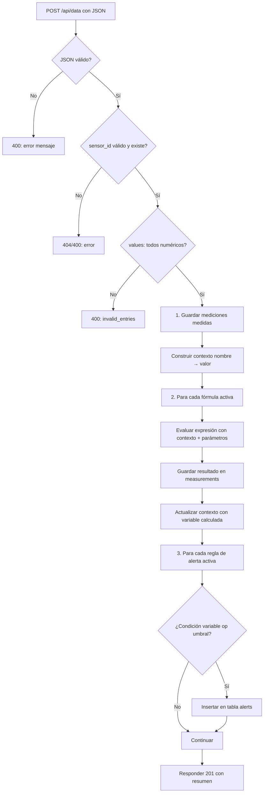

# Documentación técnica del sistema CloudSensor

**Sistema de monitoreo de sensores con variables calculadas y alertas**  
Documento técnico para tesis de ingeniería.

---

## 1. Arquitectura del sistema

### 1.1 Descripción general

El sistema CloudSensor sigue una **arquitectura cliente-servidor en tres capas**, con separación clara entre presentación, lógica de negocio y persistencia. Los datos provienen de dispositivos embebidos (NodeMCU/ESP8266) que envían mediciones vía HTTP, y son procesados y visualizados mediante una aplicación web.

```
┌─────────────────┐     HTTP/JSON      ┌─────────────────┐     REST/JSON      ┌─────────────────┐
│   NodeMCU       │ ──────────────────► │   Backend PHP   │ ◄───────────────── │  Frontend React │
│   (ESP8266)     │     POST /api/data  │   API REST      │   GET/POST/PUT/DEL  │  (Vite)         │
└─────────────────┘                    └────────┬────────┘                    └─────────────────┘
                                                │
                                                │ PDO / SQL
                                                ▼
                                        ┌─────────────────┐
                                        │   MySQL         │
                                        │   Base de datos │
                                        └─────────────────┘
```

### 1.2 Capas

| Capa | Tecnología | Responsabilidad |
|------|------------|-----------------|
| **Presentación** | React (Vite) | Interfaz de usuario: dashboard, formularios de sensores, variables, fórmulas, reglas de alerta y visualización de alertas en tiempo real. |
| **Lógica de negocio y API** | PHP (sin frameworks) | Validación de datos, evaluación de fórmulas, evaluación de reglas de alerta, persistencia y exposición de recursos vía API REST. |
| **Persistencia** | MySQL | Almacenamiento de sensores, variables, fórmulas, mediciones, reglas de alerta e historial de alertas disparadas. |
| **Dispositivos** | NodeMCU (ESP8266) | Adquisición de datos y envío periódico al backend mediante POST con cuerpo JSON. |

### 1.3 Estructura del backend (PHP)

El backend se organiza en módulos por responsabilidad:

- **`/api/index.php`**: Punto de entrada único; enruta por método HTTP y path a los controladores.
- **`/config/`**: Configuración de base de datos (PDO) y CORS.
- **`/models/`**: Acceso a datos (Sensores, Variables, Fórmulas, Mediciones, Reglas de alerta, Alertas).
- **`/controllers/`**: Lógica de cada recurso (validación, orquestación, respuestas).
- **`/utils/`**: Evaluador seguro de fórmulas y utilidad de respuestas JSON estandarizadas.

No se utilizan frameworks PHP; la comunicación con la base de datos se realiza exclusivamente con **PDO** y consultas preparadas para evitar inyección SQL.

### 1.4 Estructura del frontend (React)

- **Vite** como herramienta de construcción y servidor de desarrollo.
- **React** con componentes por pantalla (Dashboard, formularios de sensores, variables, fórmulas, reglas de alerta, lista de alertas).
- **React Router** para navegación.
- **Cliente API** centralizado que usa la variable de entorno `VITE_API_URL` para la URL base del backend, permitiendo distintos entornos sin cambiar código.

---

## 2. Diagrama de flujo de datos

### 2.1 Flujo de ingreso de datos (POST /api/data)

Cuando un dispositivo (NodeMCU) o un cliente envía una petición POST a `/api/data`, el sistema ejecuta en secuencia las etapas siguientes. El diagrama refleja el flujo implementado en `DataController`.

**Diagrama (Mermaid)** — Puede visualizarse en GitHub, GitLab, VS Code con extensión Markdown Preview Mermaid, o en [mermaid.live](https://mermaid.live) para exportar a imagen:



**Diagrama en texto (alternativa para impresión):**

```
    POST /api/data (JSON)
            │
            ▼
    ┌───────────────┐     No     ┌─────────────────┐
    │ JSON válido?   │───────────►│ 400 Error       │
    └───────┬───────┘             └─────────────────┘
            │ Sí
            ▼
    ┌───────────────┐     No     ┌─────────────────┐
    │ sensor_id     │───────────►│ 404/400 Error   │
    │ válido/existe?│             └─────────────────┘
    └───────┬───────┘
            │ Sí
            ▼
    ┌───────────────┐     No     ┌─────────────────┐
    │ values        │───────────►│ 400 invalid_    │
    │ numéricos?    │             │ entries         │
    └───────┬───────┘             └─────────────────┘
            │ Sí
            ▼
    ┌───────────────────────────────────────────────┐
    │ 1. Guardar mediciones medidas en measurements  │
    │    y construir contexto (nombre → valor)       │
    └───────────────────────┬───────────────────────┘
            │
            ▼
    ┌───────────────────────────────────────────────┐
    │ 2. Por cada fórmula: evaluar expresión,        │
    │    guardar resultado en measurements,           │
    │    actualizar contexto                          │
    └───────────────────────┬───────────────────────┘
            │
            ▼
    ┌───────────────────────────────────────────────┐
    │ 3. Por cada regla de alerta: si valor op      │
    │    umbral se cumple → insertar en alerts       │
    └───────────────────────┬───────────────────────┘
            │
            ▼
    ┌───────────────────────────────────────────────┐
    │ Responder 201 con resumen (saved_measured,      │
    │ saved_calculated, alerts_triggered)             │
    └───────────────────────────────────────────────┘
```

### 2.2 Descripción de etapas

1. **Validación de entrada**  
   Se comprueba que el cuerpo sea JSON válido, que `sensor_id` sea un entero positivo correspondiente a un sensor existente y que todos los valores en `values` sean numéricos. Cualquier fallo devuelve un código HTTP adecuado (400 o 404) y un mensaje claro en JSON.

2. **Guardado de mediciones medidas**  
   Para cada par (nombre de variable, valor) en `values`, se busca la variable del sensor con ese nombre. Si existe, se inserta una fila en `measurements` y se añade al *contexto* (mapa nombre de variable → valor) para fórmulas y alertas.

3. **Cálculo de variables derivadas**  
   Se obtienen todas las fórmulas activas del sensor. Para cada una se evalúa la expresión con el contexto actual (variables medidas + parámetros de la fórmula). El resultado se guarda en `measurements` asociado a la variable calculada (`result_variable_id`) y se actualiza el contexto con ese nombre para posibles fórmulas encadenadas.

4. **Evaluación de alertas**  
   Se obtienen las reglas de alerta activas del sensor. Para cada regla se toma el valor actual de la variable en el contexto y se compara con el umbral según el operador (>, <, >=, <=, =). Si se cumple la condición, se inserta un registro en la tabla `alerts` con el valor, umbral, operador y mensaje.

5. **Respuesta**  
   Se devuelve 201 Created con un resumen: `sensor_id`, `measured_at`, listas `saved_measured` y `saved_calculated` y número `alerts_triggered`.

### 2.3 Flujo de consulta (frontend)

El usuario utiliza la interfaz React para listar sensores, variables, fórmulas y reglas de alerta (GET a la API), y para crear o modificar recursos (POST/PUT/DELETE). La pantalla de alertas realiza **polling** cada 5 segundos (GET `/api/alerts`) para mostrar las alertas recientes sin recargar la página.

---

## 3. Evaluador de fórmulas

### 3.1 Objetivo y restricciones de seguridad

El sistema permite definir fórmulas cuya expresión es un **texto libre** (por ejemplo, `nivel*a1 + temperatura*a2 + b`). Evaluar ese texto en el servidor con `eval()` de PHP sería un riesgo de seguridad (ejecución de código arbitrario). Por ello se implementó un **evaluador propio** que:

- Acepta únicamente **números**, **operadores aritméticos** (`+`, `-`, `*`, `/`), **paréntesis** y **identificadores** (nombres de variables o parámetros).
- No interpreta ni ejecuta código; solo realiza operaciones aritméticas sobre valores numéricos obtenidos de un contexto (mapa nombre → valor).

### 3.2 Algoritmo en tres fases

El evaluador sigue un flujo de tres pasos: **tokenización**, **conversión a notación polaca inversa (RPN)** y **evaluación con pila**.

#### Fase 1: Tokenización

Se recorre la expresión carácter a carácter y se generan *tokens* con tipo y valor:

- **Número**: secuencias de dígitos y un punto decimal opcional (ej. `12.5`).
- **Identificador**: secuencias de letras, dígitos y guión bajo que cumplen el patrón de nombre de variable (ej. `nivel`, `a1`, `temperatura`).
- **Operador**: uno de `+`, `-`, `*`, `/`.
- **Paréntesis**: `(` o `)`.

Antes de tokenizar se aplica una validación por expresión regular: solo se permiten caracteres que puedan formar números, operadores, paréntesis o identificadores. Así se rechaza cualquier carácter que pudiera ser malicioso.

Se contempla el **menos unario** (expresiones como `-x` o `(-1)`): en posiciones donde el menos actúa como unario (inicio de expresión, tras operador o tras `(`) se inserta un token numérico `0` para convertir `-x` en `0-x`, y se mantiene un único algoritmo de evaluación binaria.

#### Fase 2: Conversión a RPN (notación polaca inversa)

Los tokens se transforman en una secuencia en RPN usando una pila y las precedencias de operadores (`*` y `/` con mayor precedencia que `+` y `-`). La RPN elimina la ambigüedad de la notación infija y permite evaluar con una sola pasada y una pila.

Ejemplo conceptual: la expresión `nivel * a1 + temperatura * a2` puede dar lugar a una secuencia RPN equivalente a “nivel, a1, *, temperatura, a2, *, +”.

#### Fase 3: Evaluación con pila y contexto

Se recorre la secuencia RPN:

- Para un **número**: se apila su valor.
- Para un **identificador**: se busca su nombre en el *contexto* (mapa nombre → valor). El valor debe ser numérico; se apila. Si falta el identificador o no es numérico, se lanza una excepción con mensaje claro.
- Para un **operador**: se desapilan dos operandos, se aplica la operación (con comprobación de división por cero) y se apila el resultado.

Al final debe quedar un único valor en la pila, que es el resultado de la expresión.

### 3.3 Integración en el sistema

Las fórmulas se almacenan en la tabla `formulas` con:

- `expression`: cadena con la expresión (ej. `nivel*a1 + temperatura*a2 + b`).
- `parameters`: objeto JSON con los coeficientes (ej. `{"a1": 0.5, "a2": 0.2, "b": 0}`).
- `result_variable_id`: referencia a la variable calculada que almacenará el resultado.

Al procesar POST `/api/data`, el contexto inicial contiene los nombres y valores de las variables medidas recibidas; se fusiona con los parámetros de cada fórmula. El resultado de `FormulaEvaluator::evaluate()` se persiste en `measurements` para la variable calculada y se añade al contexto para el resto de fórmulas y para las reglas de alerta.

---

## 4. Sistema de alertas

### 4.1 Modelo de datos

- **Reglas de alerta** (`alert_rules`): definen *cuándo* se debe disparar una alerta. Cada regla asocia:
  - un **sensor**,
  - una **variable** (medida o calculada),
  - un **operador** (`>`, `<`, `>=`, `<=`, `=`) y un **valor umbral**.
  Opcionalmente incluyen una descripción y un flag `is_active`.

- **Alertas** (`alerts`): registran *cada vez* que una regla se cumple. Guardan la regla, sensor, variable, valor que disparó la alerta, umbral, operador, mensaje y fecha. Un campo `read_at` permite marcar la alerta como leída desde la interfaz.

### 4.2 Momento de evaluación

Las reglas **no** se evalúan en un proceso aparte ni por cron: se evalúan **en el mismo flujo** de POST `/api/data`, después de:

1. Guardar las mediciones medidas.
2. Calcular y guardar las variables derivadas (fórmulas).

En ese momento el *contexto* tiene todos los valores actuales (medidos y calculados). Para cada regla activa del sensor se obtiene el valor de la variable en el contexto; si la comparación con el umbral según el operador es verdadera, se inserta una fila en `alerts`.

Ventajas de este diseño:

- No requiere colas ni workers.
- La alerta se genera con los mismos datos que acaban de persistirse (consistencia).
- Implementación simple y predecible para un sistema de tesis.

### 4.3 Consulta y presentación en el frontend

El frontend consume GET `/api/alerts` (con parámetros opcionales como `sensor_id`, `unread_only`, `limit`). La página de alertas hace **polling** cada 5 segundos para actualizar la lista sin recargar, ofreciendo una visión cercana a tiempo real. El usuario puede marcar alertas como leídas mediante POST `/api/alerts/:id/read`.

---

## 5. Justificación de la elección tecnológica (PHP + React + MySQL)

### 5.1 PHP en el backend

- **Amplia disponibilidad en entornos de hosting**: muchos proveedores ofrecen PHP y MySQL sin necesidad de soporte para Node.js o runtimes adicionales, lo que facilita el despliegue y la reproducibilidad en el ámbito académico.
- **Independencia de frameworks**: el desarrollo con PHP “puro” y PDO permite explicar de forma directa la conexión a base de datos, las consultas preparadas y la estructura de una API REST, lo que resulta adecuado para una tesis donde se debe justificar cada decisión.
- **Rendimiento suficiente** para el caso de uso: recepción esporádica de datos de sensores y consultas desde una única aplicación web; no se exigen altísimas concurrencias.
- **Seguridad**: uso de PDO con consultas preparadas (evitar inyección SQL), validación explícita de entrada y un evaluador de fórmulas que no usa `eval()`, lo que permite argumentar medidas de seguridad en el documento.

### 5.2 React en el frontend

- **Componentes reutilizables**: la interfaz se estructura en componentes (formularios, listas, mensajes, tarjetas), lo que favorece la claridad del diseño y la mantenibilidad.
- **Estado local y efectos**: el uso de `useState` y `useEffect` permite describir de forma ordenada el ciclo de carga de datos, el envío de formularios y el polling de alertas, lo que es didáctico para un documento técnico.
- **Ecosistema y documentación**: React y Vite están muy documentados y son habituales en proyectos académicos y profesionales, lo que facilita la revisión y la extensión del trabajo.
- **Separación frontend/backend**: la aplicación React se comunica con el servidor solo vía HTTP y JSON, lo que refuerza la arquitectura en capas y la posibilidad de reemplazar o duplicar el frontend (por ejemplo, una app móvil) sin cambiar la API.

### 5.3 MySQL como base de datos

- **Modelo relacional**: sensores, variables, fórmulas, mediciones y alertas se modelan de forma natural con tablas y relaciones (claves foráneas, integridad referencial), lo que permite explicar el diseño de datos y las consultas SQL en la tesis.
- **Madurez y estabilidad**: MySQL (o compatibles como MariaDB) son estándar en entornos educativos y en muchos servidores compartidos, lo que simplifica la instalación y la reproducibilidad de los resultados.
- **Soporte JSON**: la columna `parameters` en la tabla `formulas` utiliza el tipo JSON de MySQL, lo que permite almacenar coeficientes de forma estructurada sin multiplicar columnas y manteniendo la posibilidad de consultas y validaciones.
- **Transacciones y consistencia**: el uso de InnoDB y claves foráneas con eliminación en cascada ayuda a mantener la consistencia cuando se borran sensores o variables, algo que puede describirse explícitamente en la documentación.

### 5.4 Coherencia del stack

La combinación PHP + React + MySQL es coherente para un sistema de tesis porque:

- Reduce la superficie de tecnologías a justificar (un lenguaje de servidor, un framework de interfaz, una base de datos).
- Permite desplegar el backend en un servidor PHP estándar y el frontend como sitio estático (build de Vite), sin necesidad de contenedores o orquestación compleja.
- Facilita que un tribunal o revisor replique el sistema con instrucciones mínimas (PHP, Node.js para construir el frontend, MySQL y el schema proporcionado).

---

## Referencias internas del proyecto

- Backend: `backend/controllers/DataController.php` (flujo de datos), `backend/utils/FormulaEvaluator.php` (evaluador de fórmulas).
- Base de datos: `database/schema.sql` (tablas y relaciones).
- API: `backend/api/index.php` (enrutado) y `backend/utils/JsonResponse.php` (respuestas estandarizadas).

---

*Documento técnico — Sistema CloudSensor — Tesis de ingeniería.*
